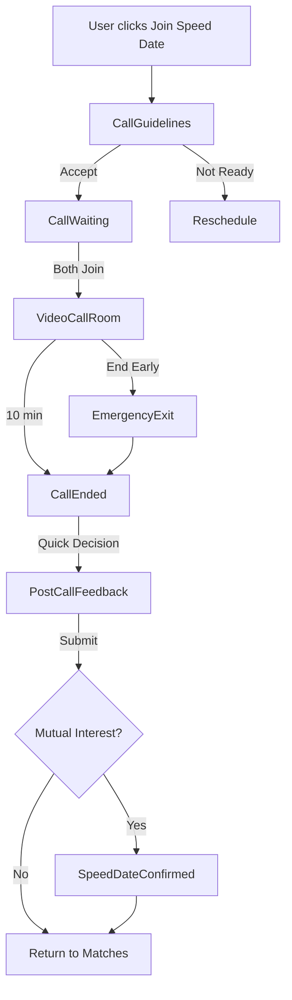

# Speed Date Video Call System

Complete video calling system for 10-minute speed dates on Footloose No More matrimonial platform.

## 📋 Table of Contents

- [Overview](#overview)
- [Components](#components)
- [Flow](#flow)
- [WebRTC Integration](#webrtc-integration)
- [Usage](#usage)
- [Backend Requirements](#backend-requirements)
- [Deployment](#deployment)
- [Analytics](#analytics)
- [Security](#security)

---

## Overview

The video call system provides a seamless, professional 10-minute speed dating experience optimized for mobile PWAs. It includes:

- ✅ Pre-call guidelines and consent
- ✅ Waiting room with tech check
- ✅ High-quality video/audio call
- ✅ Real-time connection monitoring
- ✅ Emergency exit options
- ✅ Post-call feedback
- ✅ Mutual interest matching
- ✅ Comprehensive error handling

---

## Components

### 1. **CallGuidelines.tsx**
Pre-call modal with rules and consent.

**Props:**
```typescript
interface CallGuidelinesProps {
  matchName: string;
  matchAge: number;
  matchPhoto: string;
  matchLocation: string;
  compatibility: number;
  onJoinCall: () => void;
  onNotReady: () => void;
}
```

**Features:**
- Guidelines and tips
- Privacy notice
- Match info preview
- Required consent checkbox

---

### 2. **CallWaiting.tsx**
Waiting room while other participant joins.

**Props:**
```typescript
interface CallWaitingProps {
  matchName: string;
  matchAge: number;
  matchPhoto: string;
  matchOccupation: string;
  matchLocation: string;
  compatibility: number;
  timeRemaining: string;
  cameraWorking: boolean;
  micWorking: boolean;
  connectionQuality: 'excellent' | 'fair' | 'poor';
  onCancel: () => void;
  onSendReminder: () => void;
}
```

**Features:**
- Video preview
- Tech check status
- Connection quality indicator
- Conversation starters carousel
- Send reminder (after 2 min)
- Timer countdown

---

### 3. **VideoCallRoom.tsx**
Main video call interface.

**Props:**
```typescript
interface VideoCallRoomProps {
  matchName: string;
  matchAge: number;
  matchPhoto: string;
  localStream: MediaStream | null;
  remoteStream: MediaStream | null;
  onEndCall: (reason?: string) => void;
  onReport: () => void;
}
```

**Features:**
- Large video (other person)
- Picture-in-picture (you)
- Swappable views
- Video controls (mute, camera, end)
- 10-minute countdown timer
- Connection quality monitoring
- Speaking indicators
- Emergency exit

---

### 4. **VideoControls.tsx**
Floating control bar.

**Controls:**
- Mute/unmute microphone
- Toggle camera
- Switch camera (front/back)
- End call button
- Report button (optional)

---

### 5. **CallTimer.tsx**
Countdown timer (10:00 → 00:00).

**Features:**
- Color-coded (green → yellow → red)
- Warnings at 5:00, 1:00, 0:30, 0:10
- Pause during reconnection
- Auto-end at 00:00

---

### 6. **ParticipantVideo.tsx**
Video stream display component.

**Features:**
- Video or fallback photo
- Speaking indicator
- Muted indicator
- Mirror mode for local user
- Tap to swap views

---

### 7. **ConnectionQuality.tsx**
Network quality indicator.

**Levels:**
- Excellent (green)
- Fair (yellow)
- Poor (red) with suggestion

---

### 8. **CallEnded.tsx**
Quick interest decision screen.

**Features:**
- Call duration display
- Quick decision: "Connect" or "Not a match"
- Auto-advance after 60s
- Privacy notice

---

### 9. **PostCallFeedback.tsx**
Detailed feedback form.

**Questions:**
1. Overall rating (5 stars)
2. Connection quality
3. Would recommend?
4. Followed guidelines?
5. Interest level
6. Additional comments

---

### 10. **EmergencyExit.tsx**
Early call exit with reason.

**Reasons:**
- Technical issues
- Inappropriate behavior
- No connection
- Personal emergency
- Other

**Features:**
- Report form (if inappropriate)
- Refund info
- Privacy note

---

### 11. **TechnicalIssue.tsx**
Error handling for all scenarios.

**Issue Types:**
- Camera permission denied
- Microphone permission denied
- Connection lost
- WebRTC not supported
- Remote video failed

---

### 12. **SpeedDateCallFlow.tsx**
Complete integration example.

**Flow:**
```
Guidelines → Waiting → Active Call → Ended → Feedback → (Mutual Match?)
```

---

## Flow



---

## WebRTC Integration

### Setup

1. **Install dependencies:**
```bash
npm install simple-peer socket.io-client
# or
npm install peerjs
```

2. **Media Constraints:**
```javascript
const constraints = {
  video: {
    width: { ideal: 720 },
    height: { ideal: 1280 },
    facingMode: 'user',
    frameRate: { ideal: 30, max: 30 }
  },
  audio: {
    echoCancellation: true,
    noiseSuppression: true,
    autoGainControl: true
  }
};

const stream = await navigator.mediaDevices.getUserMedia(constraints);
```

3. **ICE Servers:**
```javascript
const configuration = {
  iceServers: [
    { urls: 'stun:stun.l.google.com:19302' },
    { urls: 'stun:stun1.l.google.com:19302' },
    {
      urls: 'turn:your-turn-server.com:3478',
      username: 'user',
      credential: 'password'
    }
  ]
};
```

### Signaling Server (WebSocket)

**Backend (Node.js + Socket.IO):**
```javascript
const io = require('socket.io')(server);

io.on('connection', (socket) => {
  socket.on('join-speed-date', ({ speedDateId, userId }) => {
    socket.join(speedDateId);
    socket.to(speedDateId).emit('peer-joined', { userId });
  });

  socket.on('webrtc-offer', ({ speedDateId, offer }) => {
    socket.to(speedDateId).emit('webrtc-offer', { offer });
  });

  socket.on('webrtc-answer', ({ speedDateId, answer }) => {
    socket.to(speedDateId).emit('webrtc-answer', { answer });
  });

  socket.on('ice-candidate', ({ speedDateId, candidate }) => {
    socket.to(speedDateId).emit('ice-candidate', { candidate });
  });
});
```

**Frontend:**
```javascript
import io from 'socket.io-client';

const socket = io('wss://your-signaling-server.com');

socket.emit('join-speed-date', { speedDateId, userId });

socket.on('webrtc-offer', async ({ offer }) => {
  await pc.setRemoteDescription(offer);
  const answer = await pc.createAnswer();
  await pc.setLocalDescription(answer);
  socket.emit('webrtc-answer', { speedDateId, answer });
});
```

### Connection Monitoring

```javascript
const pc = new RTCPeerConnection(config);

pc.oniceconnectionstatechange = () => {
  console.log('ICE state:', pc.iceConnectionState);

  if (pc.iceConnectionState === 'disconnected') {
    // Attempt reconnection
  }

  if (pc.iceConnectionState === 'failed') {
    // Show error, try ICE restart
  }
};

// Get connection stats
setInterval(async () => {
  const stats = await pc.getStats();
  stats.forEach((report) => {
    if (report.type === 'inbound-rtp' && report.mediaType === 'video') {
      console.log('Packets lost:', report.packetsLost);
      console.log('Jitter:', report.jitter);
    }
  });
}, 5000);
```

---

## Usage

### Basic Implementation

```tsx
import { SpeedDateCallFlow } from '@/components/speeddate';

function SpeedDatePage() {
  return (
    <SpeedDateCallFlow
      speedDateId="sd-123"
      matchId="user-456"
      matchName="Priya"
      matchAge={28}
      matchPhoto="https://..."
      matchLocation="Mumbai"
      matchOccupation="Software Engineer"
      compatibility={88}
      scheduledTime="6:00 PM"
      scheduledDate="Wed, Feb 12"
      onComplete={() => navigate('/speed-dates')}
      onCancel={() => navigate('/speed-dates')}
    />
  );
}
```

### Custom Integration

```tsx
import {
  CallGuidelines,
  CallWaiting,
  VideoCallRoom,
  CallEnded,
  PostCallFeedback,
} from '@/components/speeddate';

function CustomFlow() {
  const [stage, setStage] = useState('guidelines');

  // Your custom logic...

  return (
    <>
      {stage === 'guidelines' && <CallGuidelines {...props} />}
      {stage === 'waiting' && <CallWaiting {...props} />}
      {stage === 'active' && <VideoCallRoom {...props} />}
      {/* etc */}
    </>
  );
}
```

---

## Backend Requirements

### Endpoints

```typescript
// Start speed date call
POST /api/speed-dates/:id/start
Response: { roomId, signaling_token }

// End speed date call
POST /api/speed-dates/:id/end
Body: { duration, reason }

// Submit feedback
POST /api/speed-dates/:id/feedback
Body: { rating, interest_level, comments, ... }

// Check mutual interest
GET /api/speed-dates/:id/mutual-interest
Response: { mutualInterest: boolean }

// Send reminder
POST /api/speed-dates/:id/remind
```

### Database Schema

```sql
CREATE TABLE speed_date_calls (
  id UUID PRIMARY KEY,
  speed_date_id UUID REFERENCES speed_dates(id),
  started_at TIMESTAMP,
  ended_at TIMESTAMP,
  duration INTEGER, -- seconds
  end_reason VARCHAR(50),
  user1_joined BOOLEAN,
  user2_joined BOOLEAN,
  connection_quality VARCHAR(20),
  created_at TIMESTAMP DEFAULT NOW()
);

CREATE TABLE speed_date_feedback (
  id UUID PRIMARY KEY,
  speed_date_call_id UUID REFERENCES speed_date_calls(id),
  user_id UUID REFERENCES users(id),
  overall_rating INTEGER CHECK (overall_rating BETWEEN 1 AND 5),
  connection_quality VARCHAR(20),
  would_recommend VARCHAR(10),
  followed_guidelines BOOLEAN,
  interest_level VARCHAR(20),
  additional_comments TEXT,
  report_issue BOOLEAN,
  report_details TEXT,
  created_at TIMESTAMP DEFAULT NOW()
);
```

---

## Deployment

### Requirements

- **HTTPS**: WebRTC requires HTTPS (except localhost)
- **STUN/TURN Servers**: For NAT traversal
- **Signaling Server**: WebSocket server for signaling
- **CDN**: For media delivery optimization

### TURN Server Setup

Use Coturn (open source):

```bash
# Install
apt-get install coturn

# Configure /etc/turnserver.conf
listening-port=3478
fingerprint
lt-cred-mech
user=username:password
realm=your-domain.com
```

Or use managed service:
- Twilio TURN
- Xirsys
- Metered

### Environment Variables

```env
VITE_SIGNALING_SERVER_URL=wss://signal.yourdomain.com
VITE_STUN_SERVER=stun:stun.l.google.com:19302
VITE_TURN_SERVER=turn:turn.yourdomain.com:3478
VITE_TURN_USERNAME=username
VITE_TURN_CREDENTIAL=password
```

### PWA Considerations

**manifest.json:**
```json
{
  "permissions": [
    "camera",
    "microphone",
    "notifications"
  ],
  "orientation": "portrait"
}
```

**Service Worker:**
```javascript
// Bypass cache for signaling
self.addEventListener('fetch', (event) => {
  if (event.request.url.includes('/api/speed-dates/')) {
    event.respondWith(fetch(event.request));
  }
});
```

---

## Analytics

### Events to Track

```javascript
// Track these events
const events = [
  'speed_date_guidelines_accepted',
  'speed_date_waiting_room_entered',
  'speed_date_call_started',
  'speed_date_call_ended',
  'speed_date_ended_early',
  'speed_date_technical_issue',
  'speed_date_feedback_submitted',
  'speed_date_mutual_interest',
  'speed_date_reminder_sent',
  'speed_date_camera_toggled',
  'speed_date_mic_toggled',
  'speed_date_connection_quality_changed',
  'speed_date_report_filed',
];
```

### Metrics

```javascript
// Track these metrics
const metrics = {
  averageCallDuration: 'Average call duration',
  completionRate: 'Calls that reached 10 minutes',
  technicalIssueRate: 'Percentage with tech issues',
  mutualInterestRate: 'Percentage with mutual interest',
  timeToFirstMessage: 'Time from call end to first message',
  connectionQuality: 'Distribution of connection quality',
  earlyEndReasons: 'Breakdown of early end reasons',
};
```

---

## Security

### Privacy

- ✅ **No Recording**: Explicitly no server-side recording
- ✅ **P2P Connection**: Direct peer-to-peer (not through server)
- ✅ **End-to-End Encryption**: WebRTC default encryption
- ✅ **Metadata Only**: Only store duration, participants, timestamp
- ✅ **Report System**: Easy reporting with admin review

### Best Practices

1. **Permissions**: Request camera/mic only when needed
2. **HTTPS Only**: Enforce HTTPS in production
3. **Rate Limiting**: Limit speed date requests per user
4. **Content Moderation**: Review reports immediately
5. **Trust Scores**: Track user behavior patterns
6. **No Screenshots**: Prevent screenshots where possible
7. **Consent**: Explicit consent before every call

### Content Policy

```typescript
const contentPolicy = {
  prohibited: [
    'Harassment or bullying',
    'Explicit content',
    'Spam or solicitation',
    'Hate speech',
    'Threats or violence',
  ],
  consequences: {
    firstViolation: 'Warning',
    secondViolation: 'Temporary ban',
    thirdViolation: 'Permanent ban',
    severe: 'Immediate ban + legal action',
  },
};
```

---

## Testing

### Manual Testing Checklist

- [ ] Camera and mic permissions
- [ ] Video quality on slow connection
- [ ] Audio quality with echo cancellation
- [ ] Reconnection after network loss
- [ ] Timer accuracy
- [ ] Controls responsiveness
- [ ] Error handling (denied permissions, no devices, etc.)
- [ ] Mobile orientation
- [ ] Battery drain
- [ ] Multiple simultaneous calls (scalability)

### Automated Testing

```javascript
// Example with Playwright
test('Speed date call flow', async ({ page, context }) => {
  await page.goto('/speed-date/123');

  // Accept guidelines
  await page.click('input[type="checkbox"]');
  await page.click('button:has-text("Join Speed Date")');

  // Wait for camera permission
  await context.grantPermissions(['camera', 'microphone']);

  // Verify waiting room
  await expect(page.locator('text=Waiting for')).toBeVisible();

  // Mock peer connection
  // ...
});
```

---

## Troubleshooting

### Common Issues

**Camera/Mic not working:**
- Check browser permissions
- Ensure HTTPS (or localhost)
- Try different browser
- Check device settings

**Connection failed:**
- Check STUN/TURN servers
- Verify firewall settings
- Test with different network
- Check TURN credentials

**Poor video quality:**
- Reduce resolution
- Check bandwidth
- Close other apps
- Restart device

**Audio echo:**
- Enable echo cancellation
- Use headphones
- Check mic sensitivity

---

## Support

For issues or questions:
- Email: dev@footloosenmore.com
- Docs: https://docs.footloosenmore.com/video-calls
- GitHub: https://github.com/footloosenmore/pwa

---

## License

Proprietary - Footloose No More © 2026
